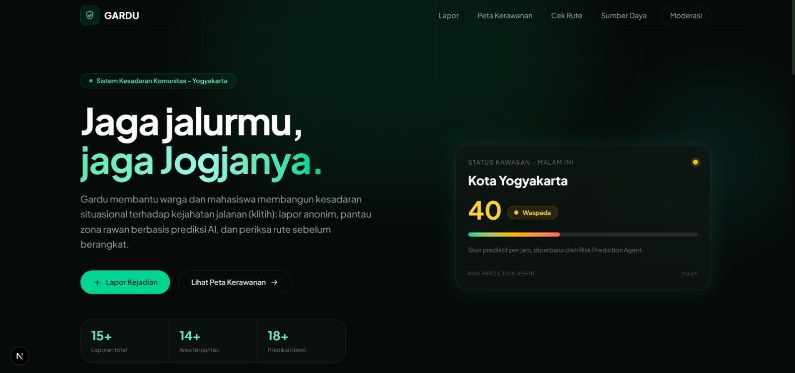
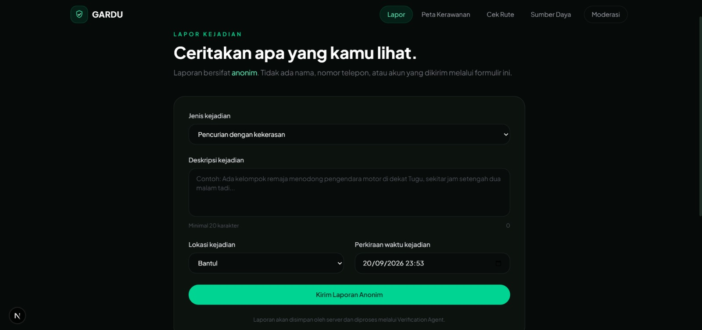
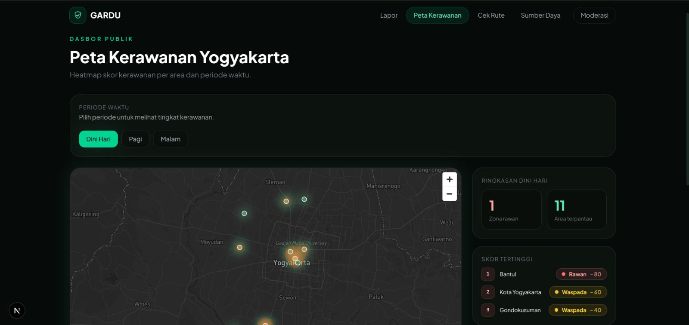
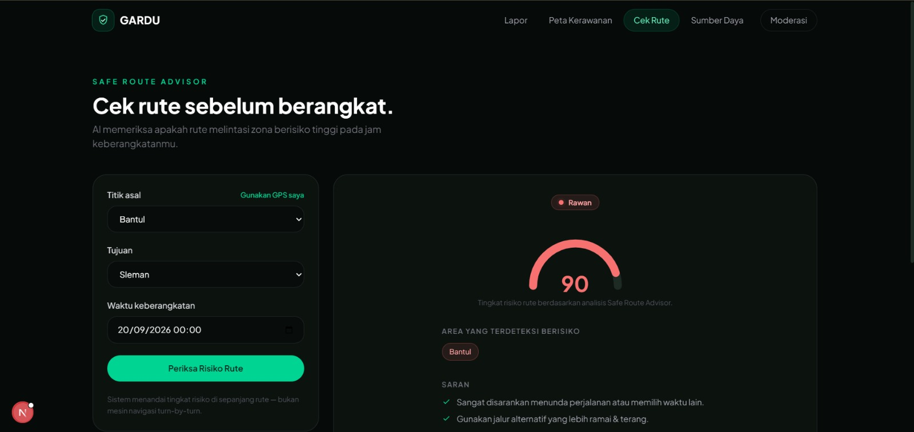

<div align="center">

# 🛡️ Gardu
**Sistem Kesadaran Komunitas dan Rute Aman Warga terhadap Kejahatan Jalanan (Klitih) di Yogyakarta**

[](https://gardu-tcc.vercel.app/)

<p align="center">
  <a href="#gambaran-umum">Gambaran Umum</a> •
  <a href="#fitur-utama">Fitur Utama</a> •
  <a href="#arsitektur-ai-agent">Arsitektur AI</a> •
  <a href="#api-endpoints">API Endpoints</a> •
  <a href="#teknologi">Teknologi</a> •
  <a href="#cara-menjalankan">Instalasi</a> •
  <a href="#struktur-direktori">Struktur Folder</a> •
  <a href="#tampilan-aplikasi">Galeri</a>
</p>

</div>

---

## 🏛️ Identitas Proyek

**Trunodjoyo Creative Competition (TCC) 2026 — Cabang Vibe Code** <br>
UKM Triple-C, Universitas Trunojoyo Madura

### 👥 Tim Gardu

| Nama Anggota | Peran |
| :--- | :--- |
| Azhar Maulana | AI Agent & Backend Owner |
| Diayu Nur Aini | Frontend & UI Owner |
| Farsya Nabila Tori | Data & Integration Owner |

---

## <a id="gambaran-umum"></a>📋 Gambaran Umum

**Gardu** adalah aplikasi web yang membantu warga dan mahasiswa di Yogyakarta membangun kesadaran situasional terhadap kejahatan jalanan (klitih) melalui pelaporan komunitas, prediksi zona/waktu rawan berbasis AI, dan rekomendasi rute yang lebih aman.

**Masalah Utama:**
Belum ada data terbuka dan real-time soal sebaran kejadian klitih di Yogyakarta. Warga tidak punya cara mudah untuk mengetahui area dan jam rawan sebelum bepergian, maupun untuk melaporkan indikasi kerawanan yang mereka saksikan.

**Solusi yang Ditawarkan:**
Gardu mengintegrasikan pelaporan komunitas anonim dengan tiga AI Agent yang bekerja sama:
1. **Verification & Clustering Agent** — mengekstrak entitas (lokasi, waktu, jenis kejadian) dari laporan teks bebas dan mengelompokkan laporan yang merujuk kejadian sama.
2. **Risk Prediction Agent** — menghitung skor kerawanan per area dan rentang waktu, dari kombinasi seed data terdokumentasi dan laporan warga terverifikasi.
3. **Safe Route Advisor** — memeriksa apakah rute yang akan dilalui pengguna melintasi zona berisiko tinggi, dan memberi saran alternatif.

---

## <a id="fitur-utama"></a>🚀 Fitur Utama

| Fitur | Deskripsi |
| :--- | :--- |
| **Lapor Kejadian** 📝 | Warga dapat melaporkan indikasi kerawanan secara anonim — tanpa akun, tanpa data identitas pribadi. |
| **Dasbor Peta Kerawanan** 🗺️ | Peta interaktif publik dengan lapisan heatmap yang menampilkan skor kerawanan per area dan waktu. |
| **Cek Rute Aman** 🧭 | Masukkan titik asal-tujuan dan waktu keberangkatan, sistem memberi status risiko rute beserta area yang sebaiknya dihindari. |
| **Sumber Daya & Kontak** 📞 | Daftar kontak resmi satgas kejahatan jalanan, program rehabilitasi remaja, dan layanan pengaduan — berorientasi pencegahan, bukan penghakiman. |
| **Panel Moderasi** 🛡️ | Halaman internal bagi tim untuk meninjau laporan yang ditandai AI sebagai berpotensi duplikat/hoaks. |

---

## <a id="arsitektur-ai-agent"></a>🤖 Arsitektur AI Agent

Gardu memanfaatkan **Gemini API (gemini-3.6-flash)** sebagai bagian inti proses pengembangan dan fungsionalitas produk, bukan sekadar pelengkap:

* **Entity Extraction:** Verification Agent memanggil Gemini dengan `response_schema` terstruktur (enum eksplisit untuk kategori waktu) agar hasil ekstraksi lokasi/waktu/jenis kejadian konsisten dan dapat diandalkan — bukan sekadar keyword matching.
* **Clustering:** laporan-laporan yang merujuk kejadian sama dikelompokkan berdasarkan kemiripan lokasi dan waktu untuk mengurangi duplikasi dan potensi hoaks.
* **Graceful Failure:** setiap pemanggilan AI dibungkus penanganan error eksplisit — laporan mentah tetap tersimpan meski API AI gagal merespons, sistem tidak pernah silent fail.

Detail lengkap kebutuhan fungsional dan non-fungsional ada di `docs/` (SRS dan data contracts).

---

## <a id="teknologi"></a>💻 Teknologi

**Frontend**
* Next.js + Tailwind CSS
* shadcn/ui — komponen antarmuka
* Framer Motion — animasi dan transisi
* Mapbox GL JS / MapLibre GL JS — peta interaktif dan heatmap

**Backend**
* FastAPI (Python) — REST API dan orkestrasi AI Agent
* Google Gemini API (`gemini-3.6-flash`) — entity extraction terstruktur
* pytest — automated testing

**Database**
* Supabase (PostgreSQL terkelola)
* pgvector — pencarian kemiripan vektor untuk clustering laporan

**Deployment**
* Frontend: Vercel
* Backend: Railway / Render
* Database & Vector Store: Supabase

---
## <a id="api-endpoints"></a>🔌 API Endpoints
 
Setelah backend berjalan di `http://127.0.0.1:8000`, dokumentasi interaktif tersedia di [`/docs`](http://127.0.0.1:8000/docs) (Swagger UI) — bisa langsung dicoba dari browser. Ringkasan endpoint yang tersedia:
 
| Method | Endpoint | Deskripsi |
| :--- | :--- | :--- |
| `POST` | `/reports` | Kirim laporan kejadian baru (anonim, tanpa data identitas). |
| `GET` | `/reports/{report_id}` | Ambil satu laporan berdasarkan ID. |
| `POST` | `/agents/verify` | Verification Agent — ekstrak lokasi/waktu/jenis kejadian dari teks laporan bebas via Gemini API, deteksi klaster laporan serupa. |
| `GET` | `/agents/risk` | Risk Prediction Agent — ambil skor kerawanan (0-100) untuk kombinasi `area` dan `time_slot` tertentu. |
| `POST` | `/agents/route-check` | Safe Route Advisor — cek status risiko (`aman` / `waspada` / `berisiko_tinggi`) untuk rute asal-tujuan pada waktu tertentu. |
 
<details>
<summary><b>Contoh Request &amp; Response</b></summary>
**`POST /reports`**
```json
// Request
{
  "description": "Ada gerombolan remaja mencurigakan bawa senjata tajam",
  "location": "Jalan Kaliurang km 5",
  "reported_at": "2026-09-20T02:00:00+07:00"
}
// Response (201)
{
  "id": "uuid-laporan",
  "status": "menunggu_verifikasi"
}
```
 
**`GET /agents/risk?area=Bantul&time_slot=dini_hari`**
```json
// Response
{
  "area": "Bantul",
  "time_slot": "dini_hari",
  "score": 80
}
```
 
**`POST /agents/route-check`**
```json
// Request
{
  "origin": "Jalan Kaliurang",
  "destination": "Malioboro",
  "departure_time": "2026-09-20T02:00:00+07:00"
}
// Response
{
  "risk_level": "waspada",
  "avoid_areas": ["Bantul", "Sleman"]
}
```
 
</details>
Detail lengkap format request/response dan skema data ada di [`docs/contracts.md`](docs/contracts.md).
 
---

## <a id="cara-menjalankan"></a>⚙️ Cara Menjalankan

Proyek ini terdiri dari dua bagian yang berjalan terpisah: **frontend** (Next.js) dan **backend** (FastAPI). Jalankan keduanya secara bersamaan di dua terminal berbeda untuk pengalaman lengkap.

### 🎨 Frontend (Next.js)

Bagian ini adalah [Next.js](https://nextjs.org) project yang di-bootstrap dengan [`create-next-app`](https://nextjs.org/docs/app/api-reference/cli/create-next-app).

**1. Masuk ke folder frontend dan install dependency**
```bash
cd frontend
npm install
```

**2. Konfigurasi environment variable**

Buat file `.env.local` di dalam folder `frontend`, isi dengan:
```bash
NEXT_PUBLIC_SUPABASE_URL=your_supabase_project_url
NEXT_PUBLIC_SUPABASE_ANON_KEY=your_supabase_anon_key
NEXT_PUBLIC_API_URL=http://localhost:8000
```

**3. Jalankan development server**
```bash
npm run dev
# atau
yarn dev
# atau
pnpm dev
# atau
bun dev
```

Buka [http://localhost:3000](http://localhost:3000) dengan browser untuk melihat hasilnya.

Kamu bisa mulai edit halaman dengan memodifikasi `app/page.tsx`. Halaman akan auto-update seiring perubahan file.

Proyek ini menggunakan [`next/font`](https://nextjs.org/docs/app/building-your-application/optimizing/fonts) untuk otomatis mengoptimasi dan memuat [Geist](https://vercel.com/font), keluarga font baru dari Vercel.

### ⚙️ Backend (FastAPI)

**1. Masuk ke folder backend dan buat virtual environment**
```bash
cd backend
python3 -m venv .venv
source .venv/bin/activate   # Windows: .venv\Scripts\activate
```

**2. Install dependency**
```bash
pip install -r requirements.txt
```

**3. Konfigurasi environment variable**

Salin `.env.example` menjadi `.env`, lalu isi dengan kredensial asli:
```bash
cp .env.example .env
```
```
SUPABASE_URL=
SUPABASE_ANON_KEY=
SUPABASE_SERVICE_ROLE_KEY=
GEMINI_API_KEY=
```

**4. Jalankan migration database**

Buka Supabase Dashboard → SQL Editor, jalankan isi file `database/migrations/0001_init_schema.sql`.

**5. Jalankan server**
```bash
uvicorn backend.main:app --reload --port 8000
```

Buka [http://127.0.0.1:8000/docs](http://127.0.0.1:8000/docs) untuk melihat dokumentasi API interaktif (Swagger UI) dan mencoba setiap endpoint langsung dari browser.

**6. Menjalankan test**
```bash
python -m pytest backend/tests/ -v
```

---

## <a id="struktur-direktori"></a>📂 Struktur Direktori

```text
gardu/
├── frontend/                        # Next.js App — UI & halaman publik
│   ├── app/                         # Landing, /lapor, /peta, /rute, /admin, /sumber-daya
│   ├── components/                  # Komponen UI (shadcn/ui)
│   └── lib/                         # Helper & service call ke backend
│
├── backend/                         # FastAPI — REST API & orkestrasi AI Agent
│   ├── agents/                      # Verification, Risk Prediction, Safe Route Advisor
│   ├── db/                          # Koneksi Supabase & query helper
│   ├── tests/                       # Automated test (pytest)
│   ├── main.py                      # Entry point FastAPI
│   └── requirements.txt
│
├── database/
│   └── migrations/                  # Skema SQL: reports, seed_data, risk_scores
│
├── docs/
│   ├── contracts.md                 # Kontrak skema data & format request/response API
│   └── skills/                      # Panduan konvensi kerja per modul (frontend/agents/data)
│
├── CLAUDE.md                        # Konvensi & aturan kerja proyek untuk AI coding agent
└── README.md
```

---

## <a id="tampilan-aplikasi"></a>📸 Tampilan Aplikasi

Berikut adalah cuplikan antarmuka dari Gardu:

| **Landing Page** | **Lapor Kejadian** |
| :---: | :---: |
|  |  |
| *Kesadaran Komunitas* | *Pelaporan Anonim* |

| **Dasbor Peta Kerawanan** | **Cek Rute Aman** |
| :---: | :---: |
|  |  |
| *Heatmap Interaktif* | *Rekomendasi Rute* |

---

## 📖 Pelajari Lebih Lanjut

- [Next.js Documentation](https://nextjs.org/docs) — pelajari fitur dan API Next.js.
- [FastAPI Documentation](https://fastapi.tiangolo.com) — pelajari framework backend.
- [Supabase Documentation](https://supabase.com/docs) — pelajari database dan pgvector.

## 🚀 Deploy

Frontend di-deploy menggunakan [Vercel Platform](https://vercel.com), backend menggunakan Railway/Render, dan database dikelola sepenuhnya oleh Supabase.

---
<div align="center">

Dibuat untuk **Trunodjoyo Creative Competition 2026** oleh Tim Gardu 🛡️

</div>